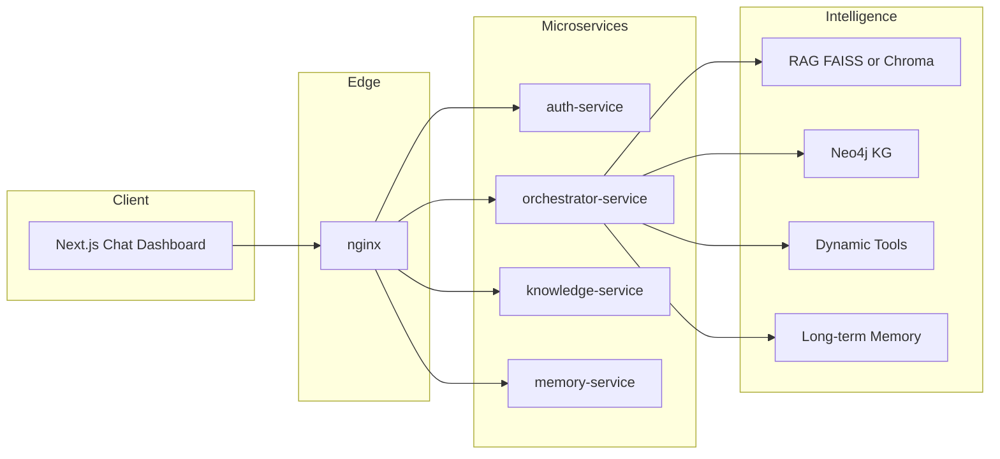

# 03 — Architecture

[← Tech stack](02-tech-stack.md) · [Back to docs hub](README.md) · [Next: System working →](04-system-working.md)

## High-level idea

Three **intelligence layers** (RAG, Knowledge Graph, Dynamic Tools + Memory) are coordinated by the **orchestrator** (LangGraph). Clients never talk to databases directly: traffic goes **Next.js → nginx → microservices**.

## Microservices

| Service | Port (internal) | Responsibility |
|---------|-----------------|----------------|
| `frontend` | 3000 | Next.js UI |
| `auth-service` | 8001 | Register, login, JWT refresh, logout |
| `orchestrator-service` | 8002 | LangGraph chat, streaming, OpenRouter |
| `knowledge-service` | 8003 | Scrape, embed, retrieve, Neo4j queries |
| `memory-service` | 8004 | Preferences, facts, transcript helpers |
| `nginx` | 80 | Path-based reverse proxy |

Details: [Microservices & nginx](21-microservices-nginx.md).

## Layer 1 — Static Knowledge (RAG)

Web scrape → clean → chunk → embed → FAISS/Chroma → top-k retrieve → re-rank → LLM.

## Layer 2 — Knowledge Graph

LLM-assisted NER + relations → Neo4j → Cypher for relational questions → fused with vector hits (**hybrid retrieval**).

## Layer 3 — Dynamic Intelligence (LangGraph)

Stateful graph: **Router → {RAG, KG, Tool, Memory} → Response Composer**. Router uses structured output / tool calling. Tools fetch live data; memory reads/writes user facts.

## Data stores

| Store | Role |
|-------|------|
| PostgreSQL | Users, sessions, messages, structured `user_memory`, `eval_logs` |
| MongoDB | Raw transcripts, embedding-backed memory snippets |
| Neo4j | Entity graph |
| FAISS/Chroma | Chunk vectors |

## LLM path

All model calls go through **OpenRouter** (chat + embeddings). Model id is selectable from the UI settings and passed per request.

## Related docs

- [How the system works](04-system-working.md)  
- [Auth & data model](20-auth-and-data.md)  
- [UI guide](13-ui-guide.md)  
