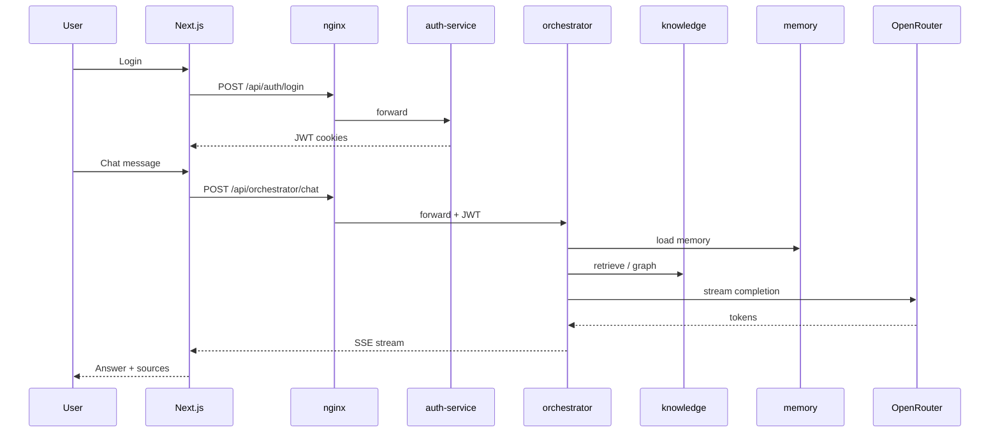

# 04 — How the System Works

[← Architecture](03-architecture.md) · [Back to docs hub](README.md) · [Next: Features →](05-features.md)

## End-to-end flow

1. User signs in on the Next.js dashboard (JWT via auth-service).  
2. User sends a message; frontend calls nginx → orchestrator.  
3. Orchestrator validates JWT, loads memory + session history.  
4. LangGraph **router** selects RAG / KG / tools / memory paths.  
5. Context is merged; OpenRouter streams the answer.  
6. Message + sources saved (Postgres); optional memory write.  
7. UI shows streaming text, citations, and optional reasoning trail.

## Routing signals

| Signal | Prefer |
|--------|--------|
| Docs / FAQ / “according to knowledge” | RAG |
| “Related to / depends on / who reports” | Knowledge graph |
| “Today / live / current” | Tools |
| “Remember that I…” | Memory write |
| Mixed | Hybrid |

## Related docs

- [LangGraph workflow](09-langgraph-workflow.md)  
- [API reference](12-api-reference.md)  
