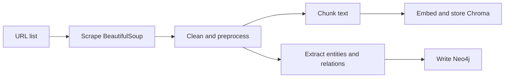

# 06 — Data Pipeline

[← Features](05-features.md) · [Back to docs hub](README.md) · [Next: RAG pipeline →](07-rag-pipeline.md)

## Purpose

Turn raw web pages into:

1. Clean text chunks for **RAG** (Chroma)
2. Entities and relationships for the **knowledge graph** (Neo4j)

## Pipeline stages

### Step 1 — Web scraping
- Input: list of URLs (config or API ingest request)
- Tool: **BeautifulSoup** (+ `requests` or `httpx`)
- Output: raw HTML → extracted main text, title, source URL

### Step 2 — Cleaning
- Remove scripts, styles, navigation noise
- Normalize whitespace
- Keep metadata: `source_url`, `title`, `fetched_at`

### Step 3 — Chunking
- Split long documents into overlapping chunks (for example 500–1000 tokens with overlap)
- Each chunk keeps a link back to its source document

Why chunk? Embeddings work better on focused passages than on entire pages.

### Step 4 — Embedding & vector storage
- Generate an embedding vector per chunk
- Upsert into **Chroma** with metadata

### Step 5 — Graph construction (parallel path)
- From cleaned text (or chunks), extract:
  - **Entities** (people, products, services, concepts)
  - **Relationships** (depends_on, works_at, related_to, …)
- Write nodes and edges into **Neo4j**

See [Knowledge graph](08-knowledge-graph.md).

## Planned ingest API usage

High-level flow once code exists:

1. `POST /ingest/urls` with a list of URLs
2. Pipeline runs asynchronously or synchronously (v1 may be sync for simplicity)
3. Response reports counts: pages scraped, chunks stored, entities created

Details: [API reference](12-api-reference.md).

## Quality tips

- Prefer a curated URL list over unlimited crawling
- Re-ingest when source pages change
- Deduplicate chunks by content hash when possible
- Store scrape errors so failed URLs can be retried

## Related docs

- [RAG pipeline](07-rag-pipeline.md)  
- [Knowledge graph](08-knowledge-graph.md)  
- [Configuration](15-configuration.md)  
