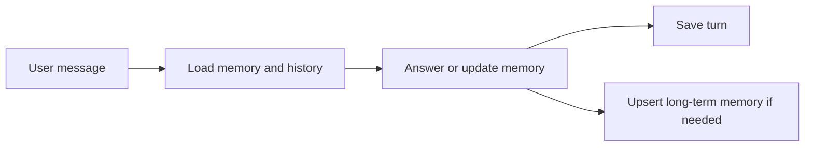

# 10 — Memory System

[← LangGraph workflow](09-langgraph-workflow.md) · [Back to docs hub](README.md) · [Next: Dynamic tools →](11-dynamic-tools.md)

## Purpose

Give the chatbot **long-term memory** so it can personalize answers across sessions—not just within one chat window.

## What we store

| Type | Examples | Store |
|------|----------|-------|
| User profile / preferences | “Prefer short bullets”, “Explain like I’m new” | MongoDB |
| Long-term facts | “My project uses Neo4j”, “Timezone IST” | MongoDB |
| Chat history | Prior user/assistant messages | MongoDB |
| Session metadata | Session id, timestamps | MongoDB |

## Memory vs chat history

- **Chat history:** recent turns for conversational continuity (short-term context window).
- **Long-term memory:** distilled preferences and facts worth keeping indefinitely.

The LangGraph `memory_load` node reads both; `memory_write` updates long-term memory when the user states a durable preference or fact.

## Lifecycle



## Personalization examples

| Stored memory | Effect on answers |
|---------------|-------------------|
| Prefers concise answers | Shorter replies, more bullets |
| Domain = “internal APIs” | Bias retrieval toward API docs |
| Name / role | Polite, role-appropriate examples |

## Privacy and safety notes (planned)

- Memory is keyed by `user_id`
- Users should be able to clear memory (future endpoint)
- Do not store secrets (API keys, passwords) in memory records
- Treat memory as **hints**, not absolute truth if it conflicts with retrieved docs

## Planned data shape (illustrative)

```json
{
  "user_id": "user_123",
  "preferences": {
    "answer_style": "concise",
    "language": "en"
  },
  "facts": [
    {"key": "preferred_cloud", "value": "AWS", "updated_at": "2026-08-08"}
  ]
}
```

## Related docs

- [LangGraph workflow](09-langgraph-workflow.md)  
- [API reference](12-api-reference.md)  
- [Configuration](15-configuration.md)  
