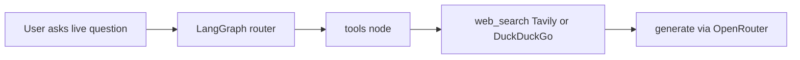

# 11 — Dynamic Tools (Web Search)

[← Memory system](10-memory-system.md) · [Back to docs hub](README.md) · [Next: API reference →](12-api-reference.md)

## Purpose

For **live** questions (weather, stock prices, news, “today/current”), the system uses a **web search tool** inside LangGraph — not separate weather/stock API integrations.

## Tools

| Tool | When | Needs API key? |
|------|------|----------------|
| `web_search` | weather, stocks, news, live facts | Optional (`TAVILY_API_KEY`); else DuckDuckGo |
| `scrape` | User pastes an `https://...` URL | No |

## Flow

## Examples

- “What’s the weather in Delhi today?” → web search  
- “Current AAPL stock price” → web search  
- “Summarize https://example.com/blog” → scrape  

## Related

- [Setup guide](14-setup-guide.md)  
- [LangGraph workflow](09-langgraph-workflow.md)  
