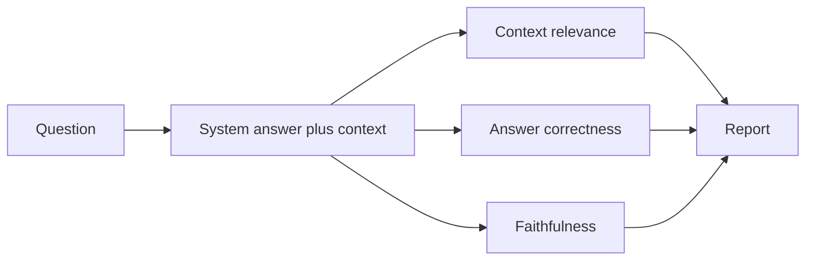

# 16 — Evaluation

[← Configuration](15-configuration.md) · [Back to docs hub](README.md) · [Next: Project structure →](17-project-structure.md)

## Why evaluate?

A chatbot can *sound* good while being wrong, off-topic, or inventing facts. This project includes a systematic evaluation layer focused on RAG quality.

## Core metrics

| Metric | Question it answers |
|--------|---------------------|
| **Context relevance** | Are the retrieved chunks actually related to the question? |
| **Answer correctness** | Is the final answer factually right (vs a reference or judged truth)? |
| **Faithfulness** | Does the answer stick to the provided context instead of hallucinating? |

These map directly to the project objectives for evaluation.

## Evaluation modes

### 1. Automated heuristics
- Retrieval score thresholds (similarity)
- Citation presence (answer references sources)
- Empty-context detection

### 2. LLM-as-judge
Given `question`, `retrieved_context`, `answer` (and optional golden answer), an LLM scores:

- relevance (1–5)
- correctness (1–5)
- faithfulness (1–5)

with a short justification.

### 3. Golden set (recommended for demos)
Maintain a small JSON/CSV set of:

- question
- expected answer points
- expected source hints

Run periodically after pipeline changes.

## Planned evaluation flow

## What to log per turn (for later scoring)

- `user_id`, `session_id`
- question / answer
- route taken
- retrieved chunk ids + scores
- graph facts used
- tool results used
- latency

## Success criteria (suggested v1 targets)

| Metric | Target (starting point) |
|--------|-------------------------|
| Context relevance (avg judge score) | ≥ 3.5 / 5 on golden set |
| Faithfulness | ≥ 4 / 5 |
| Correctness | ≥ 3.5 / 5 |
| Tool questions | Correct live field present when API succeeds |

Tune targets after the first real golden set exists.

## Related docs

- [RAG pipeline](07-rag-pipeline.md)  
- [API reference](12-api-reference.md)  
- [Development roadmap](18-development-roadmap.md)  
