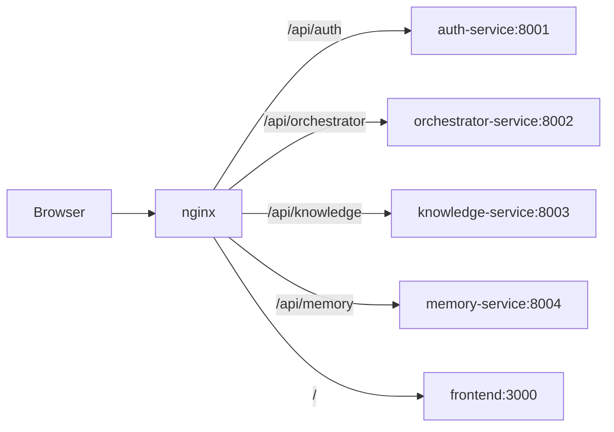

# 21 — Microservices & nginx

[← Auth & data](20-auth-and-data.md) · [Back to docs hub](README.md) · [Next: DevOps →](22-devops.md)

## Why microservices here

Separates **identity**, **orchestration**, **knowledge**, and **memory** so the academic project demonstrates real system design (and so RAG ingest cannot block chat auth).

## Service map

## nginx responsibilities

- Terminate public HTTP (TLS later)
- Path-based reverse proxy
- Optional rate limiting / request size limits
- Hide internal ports from the browser

## Inter-service calls

| Caller | Callee | Why |
|--------|--------|-----|
| orchestrator | knowledge | RAG retrieve + KG query |
| orchestrator | memory | Load/write user memory |
| orchestrator | auth (JWKS/shared secret) | Validate user on chat |
| frontend | all via nginx | Single origin |

Services share `JWT_SECRET` for HS256 validation in v1 (simple student deploy). Can move to asymmetric keys later.

## Health

Each service exposes `GET /health`. nginx can proxy readiness for Compose healthchecks.

## Related docs

- [Architecture](03-architecture.md)  
- [Setup guide](14-setup-guide.md)  
- [Project structure](17-project-structure.md)  
