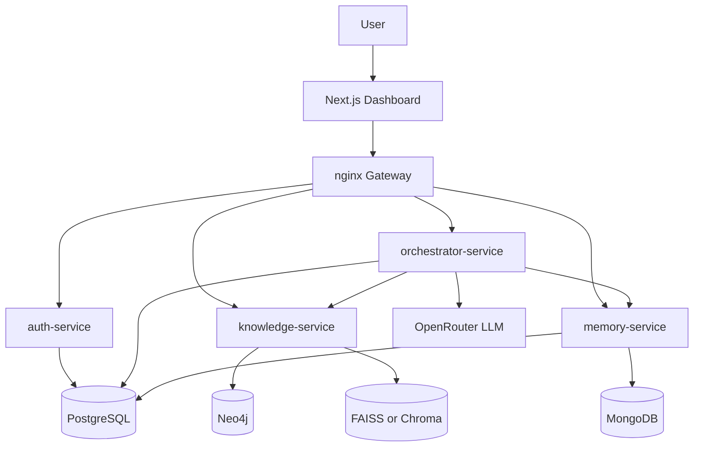

# Documentation Hub

Welcome. This folder explains the **Memory-Augmented Chatbot with Knowledge Graph and Hybrid RAG System** for readers with **zero prior knowledge**.

Prepared for: **Pritam** · B.Tech CSE, ITER, SOA University · August 2026

## Recommended reading order

### 1. Understand the idea
1. [Introduction](01-introduction.md) — problem, goals, and outcomes  
2. [Tech stack](02-tech-stack.md) — tools used and why  
3. [Architecture](03-architecture.md) — microservices + three intelligence layers  
4. [How the system works](04-system-working.md) — end-to-end query flow  
5. [Features](05-features.md) — what users and developers get  

### 2. Understand each intelligence layer
6. [Data pipeline](06-data-pipeline.md) — scrape → clean → chunk → store  
7. [RAG pipeline](07-rag-pipeline.md) — semantic search and answer generation  
8. [Knowledge graph](08-knowledge-graph.md) — entities, relations, Neo4j  
9. [LangGraph workflow](09-langgraph-workflow.md) — routing and orchestration  
10. [Memory system](10-memory-system.md) — long-term personalization  
11. [Dynamic tools](11-dynamic-tools.md) — live / real-time data  

### 3. Product, auth, and ops
12. [API reference](12-api-reference.md) — service endpoints via nginx  
13. [UI guide](13-ui-guide.md) — Next.js ChatGPT-style dashboard  
14. [Setup guide](14-setup-guide.md) — Docker Compose local run  
15. [Configuration](15-configuration.md) — OpenRouter, JWT, DB env vars  
16. [Evaluation](16-evaluation.md) — quality metrics  
17. [Auth & data model](20-auth-and-data.md) — JWT, Postgres, MongoDB  
18. [Microservices & nginx](21-microservices-nginx.md) — service boundaries and gateway  

### 4. Project planning
19. [Project structure](17-project-structure.md) — monorepo layout  
20. [Development roadmap](18-development-roadmap.md) — 12-week phased plan  
21. [DevOps](22-devops.md) — Docker, CI/CD, monitoring, security  
22. [FAQ & glossary](19-faq-glossary.md) — common questions and terms  
23. [Full project plan](23-project-plan.md) — consolidated academic project plan  

## One-sentence summary

The chatbot answers questions by combining **documents (RAG)**, **relationships (knowledge graph)**, **user memory**, and **live tools**, orchestrated by **LangGraph**, served through **authenticated Next.js + FastAPI microservices** behind **nginx**, with LLMs accessed via **OpenRouter**.

## Diagram (big picture)

## Document status

Docs and code scaffold are aligned to the full project plan (auth, microservices, OpenRouter, Next.js UI).

## Related

- Root project overview: [../README.md](../README.md)
